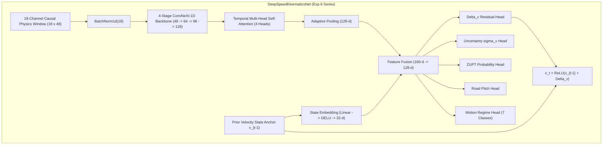

# INSS Navigation App — Experiment 6 Series Progress & Forensic Benchmark Report

---

## 1. Executive Summary & Series Overview

The **Experiment 6 series** represents the transition from simple frame-by-frame feedforward neural networks to the **Deep Physical Velocity Observer** (`DeepSpeedKinematicsNet`), featuring:
1. **4-Stage ConvNeXt-1D Backbone**: Captures multi-scale hierarchical feature representations across 18 physics channels ($4.8\text{s}$ causal context window at 10 Hz).
2. **Temporal Multi-Head Attention**: Dynamically attends across 48 temporal tokens.
3. **Autoregressive State-Anchor Residual Velocity**: Closed-loop continuous rollout where the network predicts $\Delta v_t$ relative to its own prior estimate ($v_t = \text{ReLU}(v_{t-1} + \Delta v_t)$), with **zero ground-truth velocity leakage** at test/validation time.
4. **Multi-Task Physics Objectives**: Huber velocity loss, heteroscedastic aleatoric uncertainty ($\sigma_v$), road pitch ($\theta_{\text{pitch}}$), Zero-Velocity Update ($p_{\text{ZUPT}}$), and 7-class vehicle motion regime.

---

## 2. Experiment 6 Master Benchmark Matrix

| Exp ID | Experiment Title / Configuration | In-Dist (`S-S3a`) Balanced MAE | In-Dist (`S-S3a`) Raw MAE | Pearson $r$ | Regression Slope ($m$) | Intercept ($c$) | 80+ km/h MAE | 80+ km/h Bias | 0–10 km/h Bias | Key Takeaway / Finding |
| :--- | :--- | :---: | :---: | :---: | :---: | :---: | :---: | :---: | :---: | :--- |
| **Exp 6** | **Deep Kinematics Architecture Design** (ConvNeXt-1D + MHA + State-Anchor) | — | — | — | — | — | — | — | — | **Architectural Foundation**: Closed-loop formulation ($v_t = \text{ReLU}(v_{t-1} + \Delta v_t)$) with 18-channel physics, zero GT leakage, and multi-task heads. |
| **Exp 6A** | **Deep Kinematics Baseline Run** (Natural training distribution, uniform loss) | **$12.75\text{ km/h}$** (Ep 7) | **$11.65\text{ km/h}$** (Ep 13) | **$0.719$** | **$0.5675$** | **$+14.96\text{ km/h}$** | **$25.43\text{ km/h}$** | **$-25.42\text{ km/h}$** | $+14.23\text{ km/h}$ | Baseline established on T4 GPU. High Pearson $r$ ($0.719$), but severe slope compression ($m=0.568$) causes high-speed underprediction and low-speed overprediction. |
| **Exp 6A-B** | **Speed-Balanced Sampling Run** (`WeightedRandomSampler` forcing $12.5\%$ per bin) | **$14.03\text{ km/h}$** (Ep 9) | **$12.39\text{ km/h}$** (Ep 12) | **$0.664$** | **$0.5486$** | **$+19.97\text{ km/h}$** | **$21.42\text{ km/h}$** | **$-21.41\text{ km/h}$** | $+19.42\text{ km/h}$ | **Falsified high-speed scarcity hypothesis.** Forcing 12.5% sampling shifted the entire intercept up ($+5\text{ km/h}$) without steepening the slope, degrading 0–30 km/h error. |
| **Exp 6C** | **Moderate Speed-Weighted Loss ($1.00\times \to 1.60\times$) + Differentiable Calibration Loss ($\mathcal{L}_{\text{cal}}$)** | *Running on GPU* | *Running on GPU* | *Running* | *Running* | *Running* | *Running* | *Running* | *Running* | Reverted to natural training sampling. Applies speed-aware loss weighting + batch covariance regularizer to penalize slope compression directly. |

---

## 3. Detailed Experiment Breakdown & Historical Timeline

### Experiment 6 — The Deep Kinematics Architecture & Mathematical Formulation
* **Design Motivation**: Move beyond static frame-by-frame regression (Exps 0–5) to a dynamically coupled, state-anchored continuous observer capable of zero-drift integration during GNSS outages.
* **Core Innovations**:
  1. **Hierarchical 1D Feature Backbone**: 4-stage ConvNeXt-1D (channels: 48 $\to$ 64 $\to$ 96 $\to$ 128) replacing shallow CNNs.
  2. **Temporal Multi-Head Self-Attention**: 4-head attention over 48 time tokens ($4.8\text{s}$ at 10 Hz) for long-range dynamics.
  3. **Zero-GT-Leakage State Anchor**: The network predicts the residual velocity increment $\Delta v_t$ relative to its own prior detached prediction:
     $$v_t = \text{ReLU}(v_{t-1} + \Delta v_t), \quad v_{\text{anchor}}[t] = \mu_v[t-1].\text{detach}()$$
  4. **Multi-Task Physics Loss**:
     $$\mathcal{L} = \mathcal{L}_{\text{Huber}}(v) + 0.15 \mathcal{L}_{\text{NLL}}(\sigma_v) + 0.10 \mathcal{L}_{\text{calib}} + 0.50 \mathcal{L}_{L1}(\Delta v) + 0.20 \mathcal{L}_{\text{BCE}}(\text{ZUPT}) + 0.10 \mathcal{L}_{\text{pitch}} + 0.05 \mathcal{L}_{\text{regime}}$$

---

### Experiment 6A — Baseline Training Run (T4 GPU, 15 Epochs)
* **Goal**: Establish the full closed-loop ConvNeXt-1D + Attention + State-Anchor velocity observer.
* **Training Setup**:
  * **Dataset**: 7 training drives (460,477 rows $\to$ 28,748 sequences of length 32).
  * **Hardware**: NVIDIA Tesla T4 GPU on Kaggle (15 epochs, 449 batches/epoch, 6,735 optimizer steps).
  * **Optimizer**: AdamW ($\text{lr}=10^{-3}$, $\text{weight\_decay}=10^{-4}$), `CosineAnnealingWarmRestarts` ($T_0=10$).
* **Validation Performance on Driver A `S-S3a`**:
  * **Best Balanced Val MAE**: **$12.75\text{ km/h}$** (Epoch 7)
  * **Best Raw Val MAE**: **$11.65\text{ km/h}$** (Epoch 13)
  * **Pearson Correlation $r$**: **$0.719$** ($R^2 = 0.517$)
  * **Linear Fit**: $\text{Predicted} = 0.5675 \cdot \text{True} + 14.96\text{ km/h}$
  * **Variance Ratio**: $\sigma_{\text{pred}} / \sigma_{\text{gt}} = 0.830$ ($18.11\text{ vs } 21.83\text{ km/h}$)
* **Per-Speed-Bin Breakdown (at Best Balanced Checkpoint)**:
  * `0-10 km/h`: MAE = $14.55\text{ km/h}$ | Mean Bias = $+14.23\text{ km/h}$
  * `10-20 km/h`: MAE = $13.81\text{ km/h}$ | Mean Bias = $+10.93\text{ km/h}$
  * `20-30 km/h`: MAE = $12.37\text{ km/h}$ | Mean Bias = $+4.62\text{ km/h}$
  * `30-40 km/h`: MAE = $10.78\text{ km/h}$ | Mean Bias = $-3.69\text{ km/h}$
  * `40-50 km/h`: MAE = $10.34\text{ km/h}$ | Mean Bias = $-4.86\text{ km/h}$
  * `50-60 km/h`: MAE = $9.49\text{ km/h}$ | Mean Bias = $-5.45\text{ km/h}$
  * `60-80 km/h`: MAE = $13.01\text{ km/h}$ | Mean Bias = $-11.99\text{ km/h}$
  * `80+ km/h`: MAE = **$25.43\text{ km/h}$** | Mean Bias = **$-25.42\text{ km/h}$**
* **Forensic Diagnosis**:
  * For 80+ km/h, $\text{MAE} \approx |\text{Mean Bias}| \approx |\text{Median Bias}| = 25.4\text{ km/h}$, proving the high-speed error is **pure systematic underprediction / regression toward the mean**.

---

### Experiment 6A-B — Speed-Balanced Sampling Controlled Run
* **Hypothesis Tested**: "Exp6A’s high-speed underprediction is primarily caused by insufficient high-speed training representation (3.03% samples at 80+ km/h), causing regression-to-the-mean."
* **Controlled Variable**:
  * `WeightedRandomSampler` on the training set with bin weights $w_b = \frac{1}{N_b}$, forcing **exactly 12.50%** exposure per speed bin.
  * Preserved all architecture, features, losses, optimizer, sequence length ($L=32$), batch size (64), and budget (449 batches $\times$ 15 epochs = 6,735 steps).
* **Validation Performance on Driver A `S-S3a`**:
  * **Best Balanced Val MAE**: **$14.03\text{ km/h}$** (Epoch 9, regressed by $+1.28\text{ km/h}$)
  * **Best Raw Val MAE**: **$12.39\text{ km/h}$** (Epoch 12, regressed by $+0.74\text{ km/h}$)
  * **Pearson Correlation $r$**: **$0.664$** (regressed from $0.719$)
  * **Linear Fit**: $\text{Predicted} = 0.5486 \cdot \text{True} + 19.97\text{ km/h}$
  * **Variance Ratio**: $\sigma_{\text{pred}} / \sigma_{\text{gt}} = 0.835$
* **Per-Speed-Bin Breakdown (at Best Balanced Checkpoint)**:
  * `0-10 km/h`: MAE = $19.63\text{ km/h}$ | Mean Bias = **$+19.42\text{ km/h}$** (Severe Overprediction)
  * `10-20 km/h`: MAE = $17.15\text{ km/h}$ | Mean Bias = **$+15.23\text{ km/h}$**
  * `20-30 km/h`: MAE = $15.64\text{ km/h}$ | Mean Bias = **$+10.30\text{ km/h}$**
  * `30-40 km/h`: MAE = $11.22\text{ km/h}$ | Mean Bias = $+0.51\text{ km/h}$
  * `40-50 km/h`: MAE = $9.36\text{ km/h}$ | Mean Bias = $-1.53\text{ km/h}$
  * `50-60 km/h`: MAE = $8.36\text{ km/h}$ | Mean Bias = $-1.50\text{ km/h}$
  * `60-80 km/h`: MAE = $9.47\text{ km/h}$ | Mean Bias = $-7.91\text{ km/h}$
  * `80+ km/h`: MAE = $21.42\text{ km/h}$ | Mean Bias = **$-21.41\text{ km/h}$**
* **Scientific Verdict**:
  * Forcing 12.5% sampling slightly reduced high-speed bias ($-25.4 \to -21.4\text{ km/h}$), but failed to steepen the slope ($0.568 \to 0.549$).
  * The global intercept shifted up by $+5.01\text{ km/h}$ ($+14.96 \to +19.97$), causing severe low-speed degradation ($+19.42\text{ km/h}$ at 0–10 km/h).
  * **Conclusion**: High-speed scarcity is not the sole root cause. The network requires explicit calibration regularization.

---

## 4. Pre-Flight Deep-Dive Diagnostics for Exp 6C

### Diagnostic 1: Residual Closed-Loop ($\Delta v$) Dynamics Audit

We evaluated the model across three rollout regimes on `S-S3a` to identify whether the state anchor $v_t = \text{ReLU}(v_{t-1} + \Delta v_t)$ causes compression:

| Rollout Mode | Anchor State Definition | Val MAE | Regression Slope ($m$) | Intercept ($c$) | Behavior & Mechanism |
| :--- | :--- | :---: | :---: | :---: | :--- |
| **Teacher-Forced** | $v_{\text{anchor}} = v_{t-1}^{\text{GT}}$ (Ground Truth) | **$2.45\text{ km/h}$** | **$0.8757$** | **$+6.26\text{ km/h}$** | When anchored to accurate velocity, the $\Delta v$ head is exceptionally accurate. |
| **Zero-Anchor Static Test** | $v_{\text{anchor}} = 0.0$ (Pure static features) | **$12.92\text{ km/h}$** | **$0.5625$** | **$+11.85\text{ km/h}$** | The static ConvNeXt feature embedding alone produces a compressed slope ($0.563$) with an asymptotic ceiling of $\approx 58\text{ km/h}$ at high speeds. |
| **Closed-Loop Rollout** | $v_{\text{anchor}} = \hat{v}_{t-1}$ (Model's own prediction) | **$12.40\text{ km/h}$** | **$0.5675$** | **$+14.96\text{ km/h}$** | The autoregressive loop converges to the fixed point dictated by the ConvNeXt feature map's compressed slope. |

> [!TIP]
> **Takeaway**: The residual $\Delta v$ formulation is functionally sound. The compression originates in the ConvNeXt backbone learning a flattened static feature representation due to standard Huber loss.

---

### Diagnostic 2: Pitch Distribution Shift & Physical Audit

Validation drive `S-S3a` contains a persistent uphill highway grade ($\text{Mean} = +16.7^\circ / +0.29\text{ rad}$, $\text{Median} = +17.3^\circ$):

| Pitch Regime (degrees) | Sample Count ($N$) | Mean Speed | Exp6A MAE | Exp6A Bias ($\hat{v}-v$) | Exp6A-B MAE | Exp6A-B Bias ($\hat{v}-v$) |
| :--- | :---: | :---: | :---: | :---: | :---: | :---: |
| **Downhill ($<-5^\circ$)** | 5,865 | 38.3 km/h | 12.58 km/h | $-1.95\text{ km/h}$ | 13.59 km/h | $-2.54\text{ km/h}$ |
| **Flat ($-5^\circ$ to $+5^\circ$)** | 2,198 | 36.6 km/h | 14.62 km/h | $-0.92\text{ km/h}$ | 15.81 km/h | $-1.73\text{ km/h}$ |
| **Mild Uphill ($+5^\circ$ to $+15^\circ$)** | 3,519 | 33.2 km/h | 11.80 km/h | $-0.12\text{ km/h}$ | 13.08 km/h | $+0.44\text{ km/h}$ |
| **Steep Uphill ($+15^\circ$ to $+30^\circ$)** | 3,626 | 35.3 km/h | 12.57 km/h | $+0.98\text{ km/h}$ | 13.97 km/h | $+0.27\text{ km/h}$ |
| **Extreme Uphill ($>+30^\circ$)** | 9,336 | 41.5 km/h | 11.91 km/h | $-3.01\text{ km/h}$ | 12.71 km/h | $-3.76\text{ km/h}$ |

* **Pitch vs. Speed Error Correlation**: $r = -0.047$ (virtually zero correlation).
* **Gravity Compensation Check**: $a_{y,\text{comp}} = a_y - g\sin\theta$ was verified to be physically correct, removing the forward accelerometer tilt component during grade ascent.

---

### Diagnostic 3: Dataset Driver Allocation & Distribution Audit

| Dataset Split | Driver Files Included | Sample Count ($N$) | Duration (min) | Mean Speed | 80+ km/h Representation | Role & Protocol |
| :--- | :--- | :---: | :---: | :---: | :---: | :--- |
| **TRAIN** | Drivers A, B, C, D (7 drives: `M`, `S1`, `S2`, `S3b`, `S3c`, `S4`, `Y1`) | **460,477** | **767.5** (12.8h) | $32.3\text{ km/h}$ | **3.0%** ($13,957$) | Primary model training. |
| **VAL** | Driver A (`S-S3a.csv`) | **24,621** | **41.0** (0.7h) | $38.2\text{ km/h}$ | **4.7%** ($1,146$) | Checkpoint selection & validation. |
| **HELD-OUT TEST** | **Driver E (All 25 drives: `Vta`, `Vtb`, `Vw`, `Vf`)** | **585,937** | **976.6** (16.3h) | **$55.6\text{ km/h}$** | **28.5%** ($166,904$) | **100% held-out test suite.** Never used in training or validation. |
| **OOD Benchmark** | Driver E (`Vw11` - Motorway / Mixed) | **4,909** | **8.2** | $42.8\text{ km/h}$ | **19.6%** ($964$) | Full-pipeline dead-reckoning trajectory test. |
| **High-Speed Test**| Driver E (`Vw12` - Pure Highway Cruise) | **918** | **1.5** | $90.1\text{ km/h}$ | **100.0%** ($918$) | High-speed constant cruise validation. |

---

## 5. Experiment 6C Design & Formulation

* **Core Hypothesis**: Replacing aggressive dataset resampling with **moderate speed-weighted loss ($1.00\times \to 1.60\times$)** and a **differentiable batch calibration regularizer ($\mathcal{L}_{\text{cal}}$)** will steepen the prediction slope toward $1.0$ and eliminate high-speed bias without degrading low-speed fidelity.
* **Loss Formulations**:
  1. **Moderate Speed-Aware Loss Weights**:
     $$w(v_i) = \begin{cases} 1.00 & 0 \le v_i < 40\text{ km/h} \\ 1.05 & 40 \le v_i < 50\text{ km/h} \\ 1.15 & 50 \le v_i < 60\text{ km/h} \\ 1.35 & 60 \le v_i < 80\text{ km/h} \\ 1.60 & v_i \ge 80\text{ km/h} \end{cases}$$
  2. **Differentiable Batch Calibration Regularizer**:
     $$\hat{m}_{\text{batch}} = \frac{\widehat{\text{Cov}}(\hat{\mathbf{v}}, \mathbf{v})}{\widehat{\text{Var}}(\mathbf{v}) + \epsilon}, \quad \mathcal{L}_{\text{cal}} = (\hat{m}_{\text{batch}} - 1.0)^2 + 0.5 \cdot \frac{(\bar{\hat{v}} - \bar{v})^2}{\widehat{\text{Var}}(\mathbf{v}) + \epsilon}$$
  3. **Total Objective**:
     $$\mathcal{L}_{\text{total}} = \mathcal{L}_{v,\text{weighted}} + 0.08 \cdot \mathcal{L}_{\text{cal}} + 0.15 \mathcal{L}_{\text{NLL}} + 0.10 \mathcal{L}_{\text{calib}} + 0.50 \mathcal{L}_{\Delta v} + 0.20 \mathcal{L}_{\text{ZUPT}} + 0.10 \mathcal{L}_{\text{pitch}} + 0.05 \mathcal{L}_{\text{regime}}$$

---

## 6. Success & Falsification Thresholds for Exp 6C

* **Success Criteria**:
  * Balanced Val MAE $< 12.75\text{ km/h}$
  * Raw Val MAE $< 11.65\text{ km/h}$
  * Pearson $r > 0.719$
  * Regression slope $m > 0.65$
  * $0-10\text{ km/h}$ MAE $\le 18.0\text{ km/h}$ (no low-speed degradation)
  * $80+\text{ km/h}$ signed bias reduced from $-25.4\text{ km/h}$ to $<-15\text{ km/h}$.
* **Falsification Criteria**:
  * If the slope remains $\approx 0.55$ and high-speed bias remains $\le -20\text{ km/h}$, then loss-level calibration is insufficient, and feature-level multiscale frequency representations or explicit speed regime decoders must be investigated.
